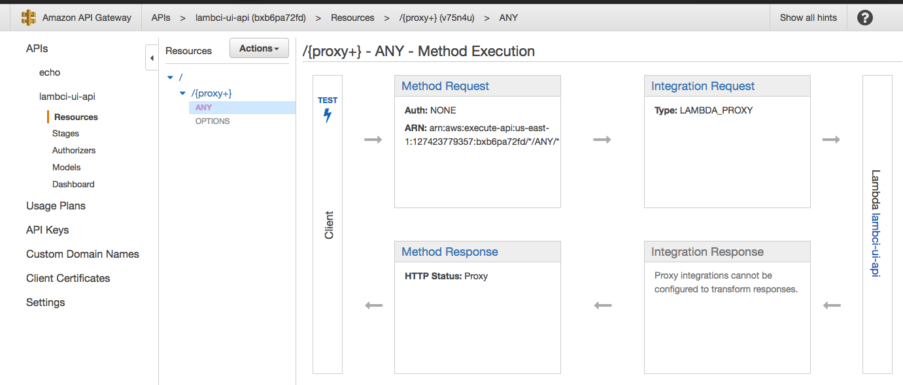

# Lambda CI UI

A UI and API to display the results of Lambda CI builds and configure projects on your lambci stack. The API runs as a lambda function but can also be run using [express](http://expressjs.com).

## Status / Roadmap as of November 2016

This is a brand new project.  Some enhancements we hope to add:
 
+ Security for the UI and API (probably using [this approach](http://www.ocelotconsulting.com/2016/10/03/cloudfront-security.html)). 
+ The ability to create a project.
+ Support for non-GitHub projects (e.g. Github Enterprise).     

## Requirements

+ [Node](https://nodejs.org/en/) 6.7.x or later.
+ An [AWS](https://aws.amazon.com) account or login plus the necessary permissions to perform the steps outlined below.
+ An existing [lambci](https://github.com/lambci/lambci) CloudFormation stack.

## Quick Setup for serverless execution

### Lambda and API Gateway setup

+ **IMPORTANT** - we don't have any guidelines for securing your API or application at this time - check back later for some examples.  Obviously you're going to want to secure your API at minimum.
+ Create a lambda function named, (for example) `lambci-ui-api` (the source code does not matter; it will be replaced).  Create a new role for the lambda from a template - S3 read-only should work for now (you'll need to update this role later).
+ Create an API that proxies your lambda function.  Refer to AWS docs on how to do this.  Make sure you enable CORS. Your API should look something like this:
 
---



---

+ **Deploy** the API and make a note of the URL (something like `https://xxxxxxx.execute-api.us-east-1.amazonaws.com/prod`)  

### UI

+ Create an S3 bucket for the UI and enable static website hosting.  You can make this endpoint public with a bucket policy if you want (**at your own risk**).
+ Configure your [aws credentials](http://docs.aws.amazon.com/sdk-for-javascript/v2/developer-guide/setting-credentials-node.html) for the build scripts.  The credentials must have the ability to:
    + Upload files into the S3 bucket.
    + Update the lambda function.
+ Deploy the UI - use the API url for the environment variable:
 
```
export API_BASE_URL=https://xxxxxxx.execute-api.us-east-1.amazonaws.com/prod
npm install # if needed
npm run deploy-ui
``` 
      
### Deploying the Lambda Function

+ You should have created a new IAM role for your new lambda function.  Ensure that this role can do the following:
    + Read and write to the *(stack name)*-config dynamoDB table.
    + Read from the *(stack name)*-builds dynamoDB table.
    + List and read objects in the S3 bucket for the lambci stack (you can find the bucket name in the *(stack name)*-config table under the 'global' project.
+ Configure your [aws credentials](http://docs.aws.amazon.com/sdk-for-javascript/v2/developer-guide/setting-credentials-node.html) for the build script.  The credentials must have the ability to updated the lambda function you created for the API.
+ Build and deploy the lambda function:

```
export LAMBCI_STACK_NAME=my-lambci-stack
export AWS_REGION=...
export API_LAMBDA_FUNCTION=lambci-ui-api
npm install # if needed
npm run deploy-lambda
```
      
## Running the API using express

Alternatively, you can run the API and the UI using [express](expressjs.com) - this example uses environment variables for everything but you might want to consider [another approach](http://docs.aws.amazon.com/sdk-for-javascript/v2/developer-guide/setting-credentials-node.html):
  
```
export LAMBCI_STACK_NAME=my-lambci-stack
export AWS_REGION=...
export AWS_ACCESS_KEY_ID=...
export AWS_SECRET_ACCESS_KEY=...
npm install
npm run build
npm prune --production
npm start
```

### Developing using express
  
Express also works in development mode:
  
```
export LAMBCI_STACK_NAME=my-lambci-stack
export AWS_REGION=...
export AWS_ACCESS_KEY_ID=...
export AWS_SECRET_ACCESS_KEY=...
npm install # if needed
npm run dev
```
  
